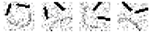

# face-classification
A neural network with no hidden layers made from scratch in Java that classifies 4 types of faces with roughly 70% accuracy without any image manipulation.

Made together with [Jakub Jasinski](https://github.com/JakubJasinski) for the class Fundamentals in Artificial Intelligence, Autumn 2016.

## Compile
The code is already compiled, but if one wants to do it again:
```
cd src
javac -Xlint:unchecked -d ../out *.java
```

## Run
The neural network is fired up by running the Faces class. To evaluate the neural network, one has to pipe the results from the neural network into the FaceTest class, to compare it to a ground truth.
```
cd out
java Faces ../Images/training-file.txt ../Images/training-facit.txt ../Images/test-file.txt | java FaceTest ../Images/facit-B.txt
```
This will run the evaluation, and show how well the neural network performed.

### Output
A common output when the evaluation is executed should look like this:
```
Percentage of correct classifications: 70.0% out of 100 images
```

## Images


The images that the neural network classifies are made out of a 20x20 pixel matrix with 32 grey scale levels, and the four classes of faces are: happy, sad, mischievous, or mad. The images are rotated randomly and located in ```Images/training-file.txt```.

## Training and Testing
The neural network is trained with a cross validated set of 200 training images, and 100 validation images. The network is then tested on 100 faces from another set.

## Network
* The network consists of 4 output nodes, one for each class.
* Each node uses a Sigmoid activation function.
* Backpropagation is used to update the weights of the network.
* The network is trained for as long as the mean squared error of the whole network is greater than 0.01, a value we found out worked good.
* The learning rate of the network is set to 0.01.
